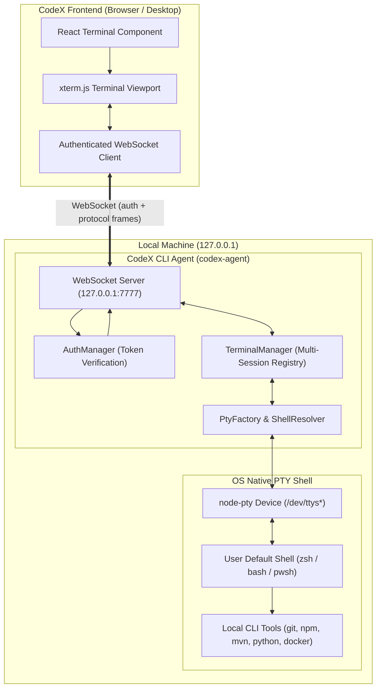

# CodeX CLI Terminal Agent (`codex-agent`)

> Production-ready, secure local CLI terminal agent bridging the **CodeX collaborative editor** frontend and the user's **real operating-system terminal**, powered by native PTY sessions.

---

## 1. What is CodeX Agent?

The **CodeX Agent** (`codex-agent`) is an independent local service that runs on the developer's computer. It manages real pseudo-terminal (PTY) sessions on macOS, Linux, and Windows, communicating with the CodeX browser/desktop frontend via a secure, authenticated loopback WebSocket connection.

Unlike basic command runners or emulators, CodeX Agent spawns a **real, full-featured interactive pseudo-terminal process** (`node-pty`). It preserves full support for:
- Interactive shells (`zsh`, `bash`, `PowerShell`, `cmd`)
- Real developer CLI tools (`git`, `npm`, `node`, `java`, `mvn`, `python`, `docker`)
- Full interactive programs (`vim`, `nano`, `htop`, `top`, `less`, `git diff`)
- Control signals and keys (`Ctrl+C`, `Ctrl+D`, `Ctrl+L`, arrow keys, Tab auto-completion, backspace)
- ANSI escape sequences and 24-bit TrueColor
- Dynamic viewport resizing (`cols` / `rows`)

---

## 2. Why Does It Exist?

In a collaborative web-based code editor, code and file trees are shared across teammates via the central collaboration server. However, **terminal execution belongs exclusively to the local developer's machine**.

1. **Local Isolation**: Terminal sessions run locally on the user's computer. Each team member has their own independent terminal without mixing command history, local paths, or environment variables.
2. **True Interactive Shell**: Spawns real interactive shells with the user's exact shell profile (`.zshrc`, `.bashrc`, environment variables, Homebrew paths, NVM/Python virtual environments).
3. **No Central Server Risk**: The collaborative server never receives raw terminal input/output by default, preventing sensitive tokens, passwords, and local commands from ever leaving the user's workstation.

---

## 3. Architecture



---

## 4. Security Model

Security is paramount because the agent has direct access to the developer's shell:

1. **Loopback Only (`127.0.0.1`)**: Bound strictly to `127.0.0.1` by default. It is never exposed publicly to `0.0.0.0`.
2. **Cryptographic Authentication**:
   - On first startup, a secure 256-bit random token is generated using `crypto.randomBytes(32).toString('hex')`.
   - Stored in `~/.codex-agent/token` with private file permissions (`0600`).
   - Constant-time string comparison (`crypto.timingSafeEqual`) prevents timing attacks.
3. **Strict Shell Path Restrictions**:
   - The frontend cannot request arbitrary executable paths (e.g. `/usr/bin/curl` or arbitrary binaries are rejected).
   - Only validated standard shells (`default`, `zsh`, `bash`, `powershell`, `pwsh`, `cmd`) are permitted.
4. **No Arbitrary Command HTTP Endpoints**:
   - The agent does not provide any HTTP `/execute` or `/readFile` endpoints.
   - All terminal interaction passes through the authenticated PTY stream.
5. **No Secret Leakage in Logs**:
   - Keystrokes, terminal input, terminal output, and tokens are redacted from logs.
   - Default CLI start command never prints the secret token to stdout.

---

## 5. Installation & CLI Usage

### Global Installation / Linking
```bash
cd codex-agent
npm install
npm run build
npm link
```

### CLI Commands

```bash
# Start the local agent (default command)
codex-agent start

# Or simply:
codex-agent

# Start with custom host and port:
codex-agent start --host 127.0.0.1 --port 7777

# Check status of the running agent:
codex-agent status

# Stop a running background agent:
codex-agent stop

# View configuration:
codex-agent config

# Display the local token (for connecting the frontend):
codex-agent config --show-token

# Regenerate a new secure token:
codex-agent config --regenerate-token

# Help and version:
codex-agent --help
codex-agent --version
```

### Startup Output Example

```text
CodeX Local Agent
────────────────────────────

Status: running
Host:   127.0.0.1
Port:   7777

Shell:  /bin/zsh

Authentication:
Token stored securely in local configuration
Config: /Users/user/.codex-agent/config.json

Waiting for CodeX...
```

---

## 6. Configuration

Configuration is stored in `~/.codex-agent/config.json`:

```json
{
  "host": "127.0.0.1",
  "port": 7777,
  "auth": {
    "tokenFile": "~/.codex-agent/token"
  },
  "terminal": {
    "maxSessions": 10,
    "idleTimeout": 1800000,
    "disconnectGracePeriod": 60000
  }
}
```

| Parameter | Type | Default | Description |
|---|---|---|---|
| `host` | `string` | `127.0.0.1` | Network interface to bind. |
| `port` | `number` | `7777` | Port for the WebSocket server. |
| `auth.tokenFile` | `string` | `~/.codex-agent/token` | Path to persistent bearer token. |
| `terminal.maxSessions` | `number` | `10` | Safety limit of simultaneous PTY sessions. |
| `terminal.idleTimeout` | `number` | `1800000` (30 min) | Max idle duration before closing abandoned sessions. |
| `terminal.disconnectGracePeriod` | `number` | `60000` (60 sec) | Grace period to keep sessions alive during browser refresh. |

---

## 7. WebSocket Protocol Summary

Full documentation is available in [`docs/protocol.md`](docs/protocol.md).

### Handshake & Authentication
```json
// Frontend -> Agent
{ "type": "auth", "token": "<token>" }

// Agent -> Frontend
{ "type": "auth.success" }
```

### Terminal Lifecycle
```json
// Create Session
{ "type": "terminal.create", "cwd": "/path/to/project", "cols": 120, "rows": 30 }
// Agent responds:
{ "type": "terminal.created", "terminalId": "term-abc123", "cwd": "/path/to/project", "shell": "/bin/zsh" }

// Send Keystroke Input
{ "type": "terminal.input", "terminalId": "term-abc123", "data": "npm run dev\r" }

// Receive PTY Output Stream
{ "type": "terminal.output", "terminalId": "term-abc123", "data": "\u001b[32mready in 200ms\u001b[0m\r\n" }

// Resize Dimensions
{ "type": "terminal.resize", "terminalId": "term-abc123", "cols": 140, "rows": 35 }

// Kill / Close Session
{ "type": "terminal.kill", "terminalId": "term-abc123" }

// Shell Process Exited
{ "type": "terminal.exit", "terminalId": "term-abc123", "exitCode": 0, "signal": null }
```

---

## 8. Cross-Platform Support

| Platform | Default Shells Detected | Config Path |
|---|---|---|
| **macOS** | `$SHELL`, `/bin/zsh`, `/bin/bash`, `/bin/sh` | `~/.codex-agent` |
| **Linux** | `$SHELL`, `/bin/bash`, `/bin/zsh`, `/bin/sh` | `~/.codex-agent` |
| **Windows** | `powershell.exe`, `pwsh.exe`, `cmd.exe` | `%APPDATA%\codex-agent` |

---

## 9. Development & Testing

```bash
# Run TypeScript compilation
npm run build

# Run full Vitest test suite
npm test

# Run tests in watch mode
npm run test:watch
```

All 27 automated unit and integration tests verify:
- Token generation and verification
- Timing safe equality check
- Protocol schema parsing and serialization
- Cross-platform shell detection and security whitelisting
- Real interactive PTY creation, safe command execution (`pwd`, `echo`), and output capture
- Dynamic terminal resizing
- Clean process exit
- Maximum session limit enforcement
- End-to-end WebSocket client integration
